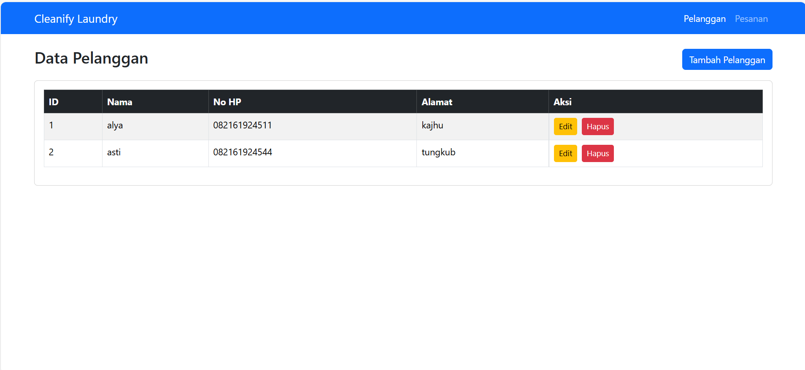
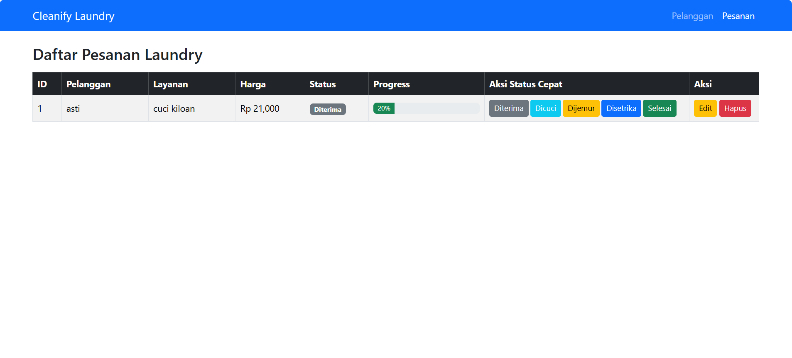

# Aplikasi Usaha Laundry (Admin)

Aplikasi ini merupakan sistem manajemen **Usaha Laundry berbasis web** yang dibuat menggunakan **Laravel**.  
Aplikasi ini difokuskan pada **fitur admin** untuk mengelola pelanggan dan pesanan laundry.

---

## 👤 Identitas
- Nama: Alya / Asti (sesuai akun GitHub)
- Mata Kuliah: Pemrograman Berbasis Web
- Framework: Laravel

---

## ✨ Fitur Aplikasi
### 🔐 Login Admin
- Admin dapat masuk ke sistem untuk mengelola data laundry

### 📊 Dashboard
- Menampilkan total pesanan
- Menampilkan pesanan dalam proses
- Menampilkan pesanan selesai
- Menampilkan total pendapatan
- Grafik pendapatan mingguan

### 👥 Manajemen Pelanggan
- Tambah pelanggan
- Edit data pelanggan
- Hapus pelanggan

### 🧺 Manajemen Pesanan
- Tambah pesanan laundry
- Edit pesanan
- Hapus pesanan
- Update status pesanan:
  - Diterima
  - Dicuci
  - Dijemur
  - Disetrika
  - Selesai
- Progress pengerjaan pesanan

---

## 🛠️ Teknologi yang Digunakan
- Laravel
- PHP
- MySQL
- Bootstrap 5
- Chart.js

---

## 📷 Screenshot Fitur
### Dashboard

### Data Pelanggan

### Data Pesanan

---

## 📌 Catatan
Aplikasi ini dibuat untuk memenuhi tugas UAS Pemrograman Berbasis Web dan hanya mencakup sisi **admin**.
